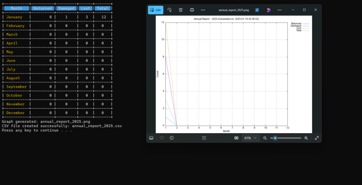
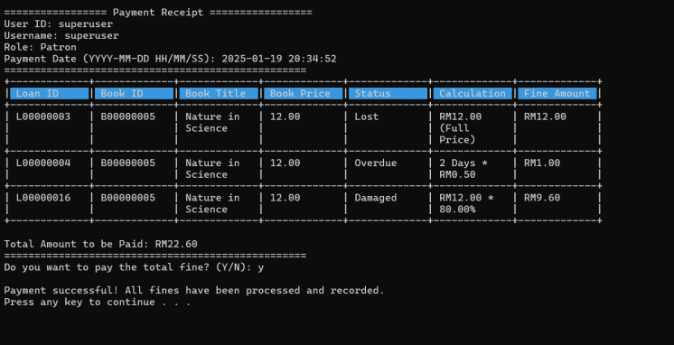
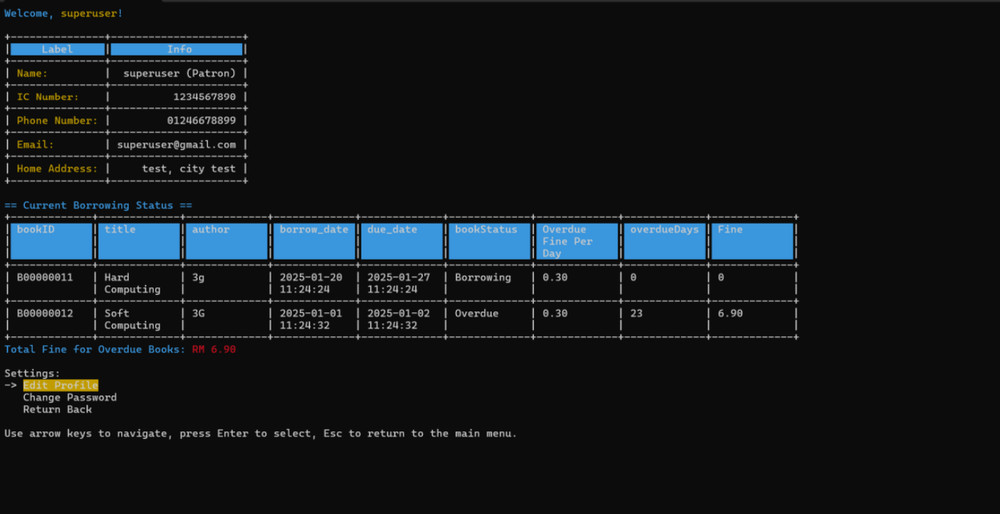

<div class="text-center p-4">
  
  
  
  
</div>

The Library Management System (LMS) is a professional-grade software solution designed to modernize traditional library operations. In the digital age, many institutions still struggle with manual book tracking and inefficient borrowing procedures. This project addresses those challenges by providing a centralized digital platform that automates core functions to enhance operational efficiency and user accountability.

The system supports Role-Based Access Control (RBAC), catering to three distinct user types: Patrons, Staff, and Admins. Patrons can search for books and manage their profiles; Staff handle daily loans and inventory; and Admins oversee system configurations, including fine rates and borrowing limits.

For this project, I was responsible for the Full-Stack Development, which included:

Database Schema Design: Implementing five major entities (User, Book, Loan, Fine, and RolePrivilege) using an SQL database to ensure robust data integrity.

Core Logic Implementation: Developing the application layer in C++, including automated fine calculations for overdue items and real-time book availability tracking.

CLI Interface: Creating a user-friendly Command Line Interface (CLI) that utilizes arrow-key navigation and color-coded outputs to improve the user experience.

Data Reporting: Integrating reporting capabilities that generate annual borrowing statistics and visualize data through graphs and tables.

Technical Implementation Snippet
The system makes extensive use of Object-Oriented Programming (OOP) principles. For instance, the dbConnection class manages all interactions with the SQL database, using pass-by-reference and constant arguments to ensure efficiency and data immutability.


Here is a snippet illustrating how the system fetches query results into a vector of maps for easy data manipulation:

```cpp
std::vector<std::map<std::string, std::string>> dbConnection::fetchResults(const std::string& query) {
    try {
        std::unique_ptr<sql::PreparedStatement> pstmt(con->prepareStatement(query));
        std::unique_ptr<sql::ResultSet> res(pstmt->executeQuery());
        std::vector<std::map<std::string, std::string>> result;
        
        while (res->next()) {
            std::map<std::string, std::string> row;
            sql::ResultSetMetaData* meta = res->getMetaData();
            for (int i = 1; i <= meta->getColumnCount(); ++i) {
                row[meta->getColumnName(i)] = res->getString(i);
            }
            result.push_back(row);
        }
        return result;
    } catch (const sql::SQLException& e) {
        throw std::runtime_error("SQL Error: " + std::string(e.what()));
    }
}
```
