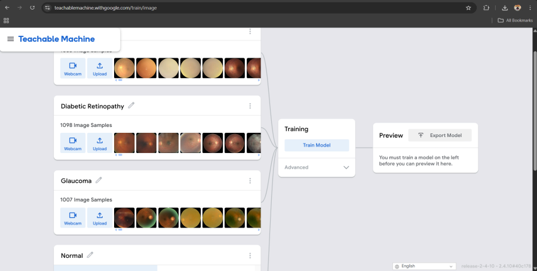
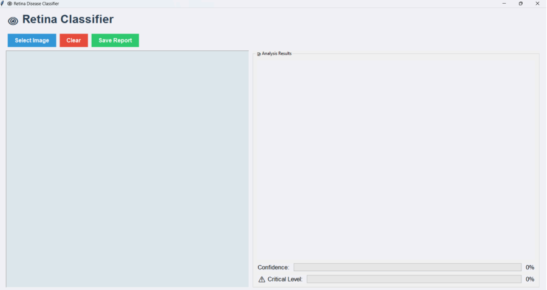
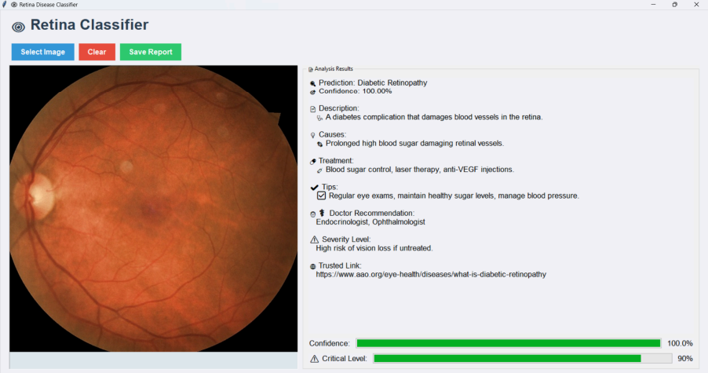

    
    
    

## Project Overview

The **Retina Classifier** is an intelligent, automated expert system developed to assist healthcare providers in the early detection and classification of vision-threatening conditions. By leveraging deep learning and advanced image processing techniques, the system analyzes retinal fundus images to identify diseases that often progress silently, such as **Diabetic Retinopathy, Glaucoma, and Cataracts**.

Traditional diagnostic methods rely heavily on manual inspection by specialists, which can be time-consuming and subject to human variability. This project aims to bridge these healthcare gaps—especially in underserved or remote regions—by providing a faster, more consistent diagnostic aid to reduce errors and help prevent irreversible vision loss.

## Key Features

- **Automated Disease Detection:** Utilizes a robust deep learning model to accurately identify and classify common retinal pathologies.
- **Rule-Based Expert System:** Implements a **Forward Chaining** inference mechanism to match extracted image attributes against a medical knowledge base for diagnostic conclusions.
- **Comprehensive Medical Insights:** Provides detailed explanations, possible causes, and general treatment recommendations for each detected condition.
- **Severity Analysis:** Automatically assesses the risk level of the detected disease to support clinical prioritization.
- **Interactive User Interface:** Features a custom-built Python GUI that allows users to upload fundus images and receive instant, structured analysis reports.

## Technical Implementation

The system was developed using **Python** and integrated with **TensorFlow/Keras** for deep learning-based classification. The expert system knowledge base was designed to recognize key medical indicators such as microaneurysms, hemorrhages, and abnormal cup-to-disc ratios.

Model training was conducted on a dataset of over 4,000 retinal fundus images sourced from Kaggle to ensure reliable performance and improved diagnostic accuracy.

  <a href="https://github.com/ThomsonTea/Retinal-Disease-Detection" class="btn btn-outline-primary">View Project on GitHub</a>
  <a href="https://youtu.be/l3tMY0K0j4s" class="btn btn-outline-danger">Watch Presentation</a>

