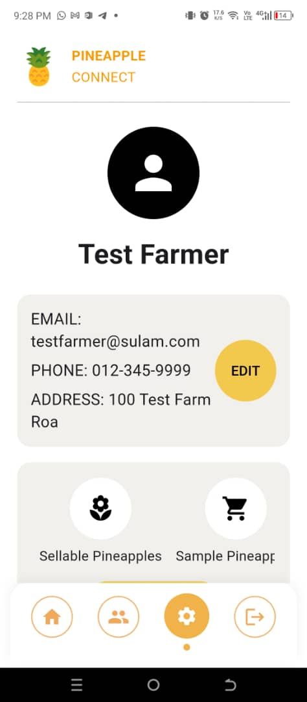
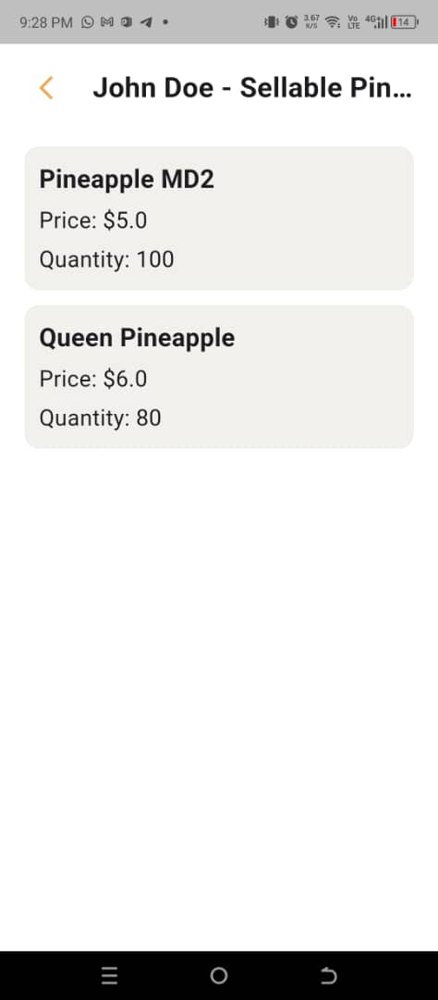
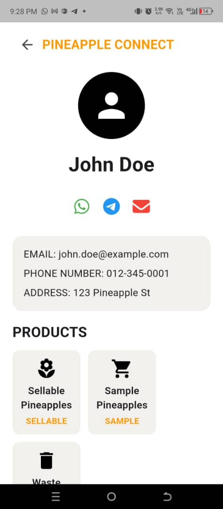

  
  
  
  
  

## <i class="fas fa-info-circle me-2"></i>Project Overview

**Pineapple Connect** is a high-impact mobile solution developed under the **SULAM (Service Learning Malaysia University for Society)** framework in collaboration with **Lembaga Perindustrian Nanas Malaysia (LPNM)**. The project addresses a critical need to modernize the agricultural supply chain in Malaysia.

The application serves as a centralized digital platform to assist key stakeholders in the industry:
* **Farmers**: List produce and manage inventory directly.
* **Wholesalers**: Access real-time price and stock information.
* **Buyers**: Contact vendors and track availability easily.

The project was awarded **3rd Place** in the LPNM National Digitalization Competition, recognizing its potential for social impact and practical digitalization.

## <i class="fas fa-layer-group me-2"></i>Key Application Features

The system is designed with several core modules to enhance operational efficiency:

### 1. Vendor Contact Management
Users can store, update, and view contact details for farmers, wholesalers, and buyers. This feature organizes communication channels, especially when dealing with multiple vendors simultaneously.

### 2. Real-Time Price Updates
The app displays current wholesale and purchase prices for pineapples. Authorized users (such as appointed farmers or wholesalers) can update these prices daily to ensure all stakeholders have access to accurate market information.

### 3. Stock Visibility & Inventory Management
Farmers can update available pineapple stock in real-time. Buyers are able to check these stock levels before contacting a vendor, which reduces miscommunication and improves overall planning.

### 4. Market Announcements & Technical Updates
A dedicated news feed provides the latest farming tips, market trends, and official announcements from agencies like LPNM. This helps users stay informed and adapt quickly to market changes.

## <i class="fas fa-rocket me-2"></i>Future Improvements

The application is designed for scalability with several planned enhancements:
* **GPS-Based Farm Mapping**: Allowing users to easily locate nearby farms.
* **Online Ordering & Delivery System**: Enabling direct purchases through the platform.
* **AI Recommendation System**: Helping farmers predict demand and determine optimal pricing.

---

  <h2 class="fw-bold mb-4"><i class="fas fa-video me-2"></i>Project Demonstration</h2>
  

    <video controls poster="{{ site.baseurl }}/img/sulam/video-placeholder.png">
      <source src="{{ site.baseurl }}/assets/videos/pineapple-demo.mp4" type="video/mp4">
      Your browser does not support the video tag.
    </video>
  

  
Demonstration of the Flutter UI and Firebase real-time synchronization.

  <a href="https://github.com/ThomsonTea/SULAM---Pineaple-Connect" class="btn btn-primary btn-lg px-4 shadow-sm">
    <i class="fab fa-github me-2"></i> View Source Code
  </a>

